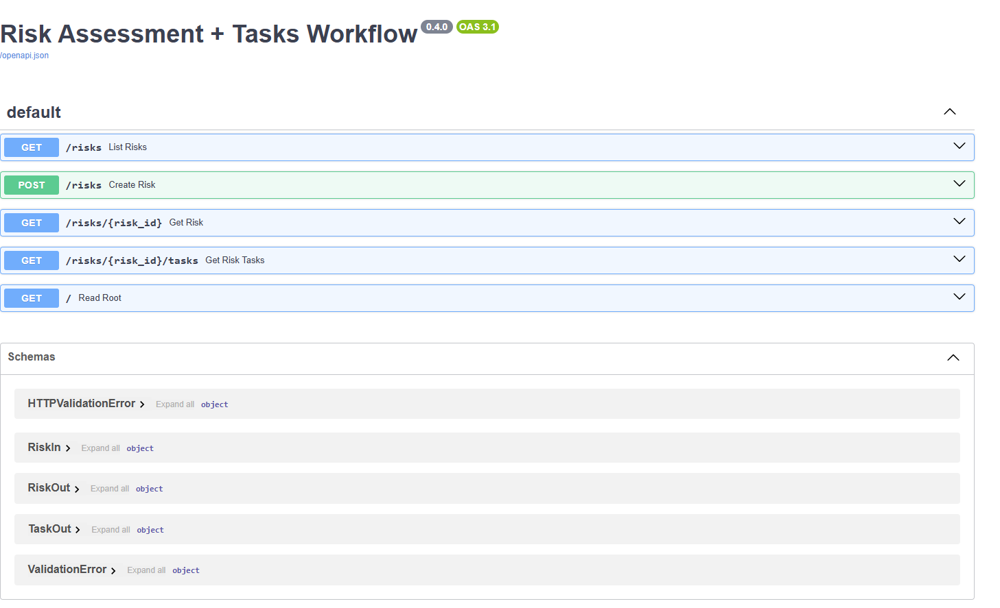

# Hazard‑Workflow API
A lightweight FastAPI-based application to capture and manage risks with automated background workflows, task assignment, and database persistence using SQLite. Includes CI/CD via GitHub Actions and Docker support.

---
A tiny FastAPI service that tracks **risks** and spawns follow‑up **tasks** automatically in a background job.

hazard-workflow/  
├── app/  
│ ├── main.py # FastAPI entry point  
│ ├── schemas.py # Pydantic request/response models  
│ ├── database.py # SQLite engine & table definitions  
│ └── init.py  
├── tests/  
│ ├── test_api.py # Unit tests using pytest  
│ └── init.py  
├── requirements.txt # Python dependencies  
├── Dockerfile # Docker image definition  
├── README.md # Project documentation  
└── .github/  
└── workflows/  
└── test.yml # GitHub Actions CI pipeline  
  
## Running with Docker
1. Build the Docker image
docker build -t hazard-api 

2. Run the container
docker run -p 8000:80 hazard-api

Then visit: http://localhost:8000/docs

## How to Test
1. Run unit tests with pytest

pip install -r requirements.txt
pytest

You’ll find test cases in tests/test_api.py.

## UI:


## Extending the App
- Add more roles or task types in schemas.py and update _workflow_create_tasks.
- Add endpoints to update task status or assign users.
- Replace SQLite with PostgreSQL for multi-user production.

## Scaling in Production
- Here’s how you could scale this app beyond a prototype:

## Replace BackgroundTasks
- Use Celery or RQ as a distributed task queue for workflows.

## Database
- Switch from SQLite to PostgreSQL or MySQL.
- Use Alembic for database migrations.

## Deployment
- Use Docker in combination with Kubernetes for advanced orchestration


## CI/CD with GitHub Actions
- Included .github/workflows/test.yml handles:
- Build & dependency setup
- Unit test execution with pytest
- Docker build & push to DockerHub (when secrets are configured)

## Quick start (local)

```bash
python -m venv .venv 
.venv\Scripts\Activate.ps1
pip install -r requirements.txt
uvicorn app.main:app --reload
pytest tests/test_api.py
